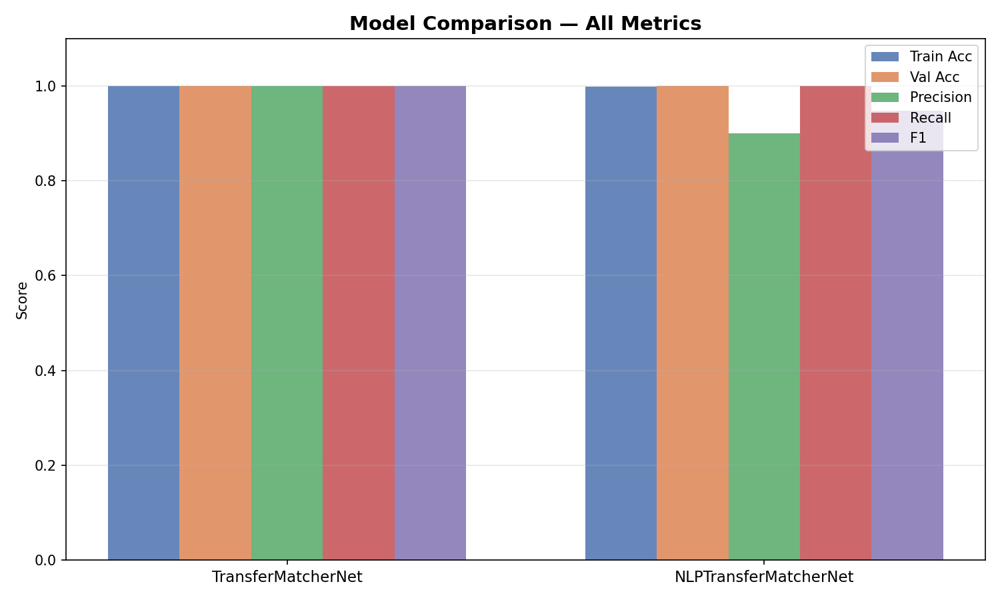
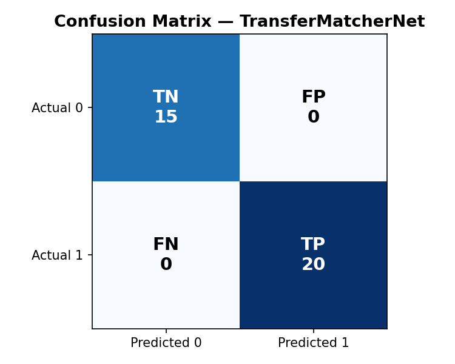
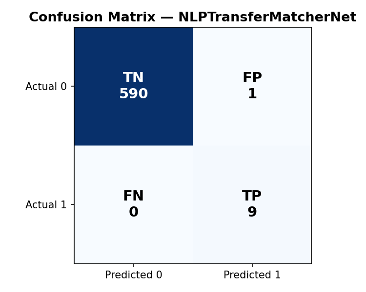

## Overview
This project presents a deep learning-based framework for automated transfer course equivalency prediction using structured academic features and semantic Knowledge Unit (KU) similarity analysis.

Two neural network architectures were developed and evaluated using PyTorch:

- TransferMatcherNet
- NLPTransferMatcherNet

The project combines:
- deep learning
- semantic similarity analysis
- TF-IDF vectorization
- Knowledge Unit mapping
- feature engineering
- educational data mining

to automate transfer equivalency prediction between university courses.

---

## Technologies Used

- Python
- PyTorch
- NumPy
- Pandas
- Scikit-learn
- Matplotlib
- Jupyter Notebook

---

## Models

### TransferMatcherNet
Structured feature-based neural network architecture using:
- course metadata
- subject similarity
- credit comparison
- engineered transfer indicators

### NLPTransferMatcherNet
Semantic NLP-based neural network architecture using:
- TF-IDF vectorization
- Knowledge Unit similarity
- semantic feature extraction
- cosine similarity metrics

---

## Experimental Results

| Model | Avg Accuracy | Avg F1 Score | Avg Validation Loss |
|---|---|---|---|
| TransferMatcherNet | 0.9086 | 0.9403 | 0.2651 |
| NLPTransferMatcherNet | 0.9976 | 0.9293 | 0.0433 |

The NLP-based architecture demonstrated highly stable classification performance across multiple experimental trials.

---

## Visualizations

### Model Performance Comparison

### Confusion Matrix - TransferMatcherNet

### Confusion Matrix - NLPTransferMatcherNet

---

## Research Paper

This repository also includes:
- IEEE-style research paper
- experimental evaluation
- training visualizations
- reproducible notebook workflow

---

## Future Improvements

Potential future extensions include:
- transformer-based semantic embeddings
- Sentence-BERT integration
- larger multi-university datasets
- explainable AI (XAI)
- deployment as a web application

---

## Author

Henal Parikh
